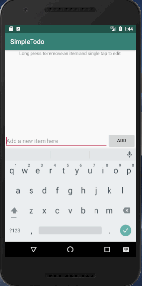

# Pre-work - *Simple Todo*

**Name of your app** is an android app that allows building a todo list and basic todo items management functionality including adding new items, editing and deleting an existing item.

Submitted by: **Simcha Coleman**

Time spent: **5** hours spent in total

## User Stories

The following **required** functionality is completed:

* [x] User can **successfully add and remove items** from the todo list
* [x] User can **tap a todo item in the list and bring up an edit screen for the todo item** and then have any changes to the text reflected in the todo list.
* [x] User can **persist todo items** and retrieve them properly on app restart

## Video Walkthrough

Here's a walkthrough of implemented user stories:

GIF created with [LiceCap](http://www.cockos.com/licecap/).

## Project Analysis

As part of your pre-work submission, please reflect on the app and answer the following questions below:

**Question 1:** "What are your reactions to the Android app development platform so far? Compare and contrast Android's approach to layouts and user interfaces in past platforms you've used."

**Answer:** I love the intuitive nature of Android Studio. As an avid huge fan of IntelliJ, coding this Android app felt like second nature. This being my first Android app, I found that the Android development platform supplies us with a massive selection of powerful Classes and Methods that make coding go smoothly and enable us to implement a wide variety of different techniques. Something I found to be especially neat was the Log feature which was easy to use and made debugging a pleasant experience. Overall, I really enjoyed creating this app and I'm looking forward to creating more in the future!

**Question 2:** "Take a moment to reflect on the `ArrayAdapter` used in your pre-work. How would you describe an adapter in this context and what is its function in Android? Why do you think the adapter is important? Explain the purpose of the `convertView` in the `getView` method of the `ArrayAdapter`."

**Answer:** An ArrayAdapter is a form of Adapter which acts as a go between for the data set, in our case an ArrayList, and the ListView, the visual list that is displayed. Essentially, the ArrayAdapter turns the data in the ArrayList into View objects which are then passed into the ListView. This transition, taking an ArrayList object and turning it into a View object is import because it enables the data to displayed properly. The convertView parameter is a way for the getView method to recycle old View objects. In our case, the convertView parameter enables the program to reuse the lines as the user scrolls down the page. So, instead of creating new lines, it simply reuses the View objects that already exist.

## License

    Copyright 2018

    Licensed under the Apache License, Version 2.0 (the "License");
    you may not use this file except in compliance with the License.
    You may obtain a copy of the License at

        http://www.apache.org/licenses/LICENSE-2.0

    Unless required by applicable law or agreed to in writing, software
    distributed under the License is distributed on an "AS IS" BASIS,
    WITHOUT WARRANTIES OR CONDITIONS OF ANY KIND, either express or implied.
    See the License for the specific language governing permissions and
    limitations under the License.
